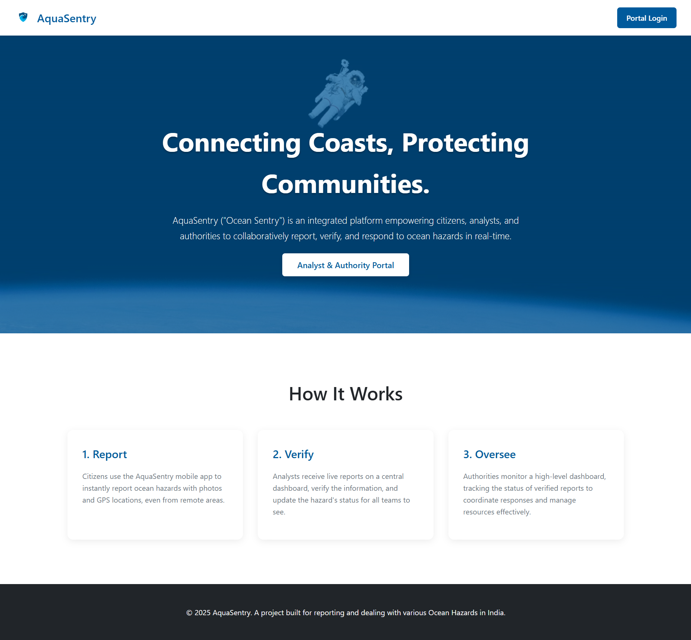
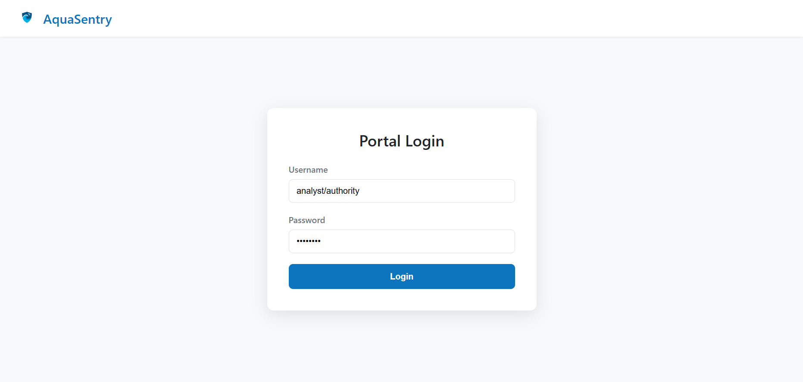
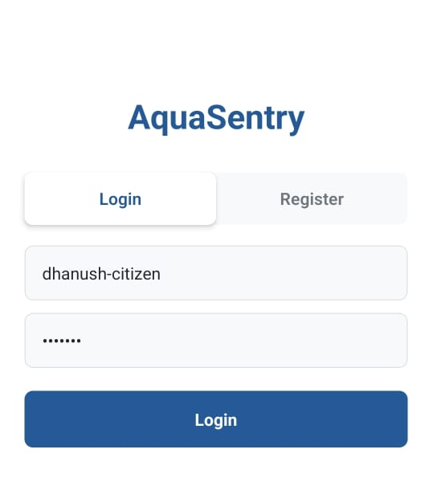
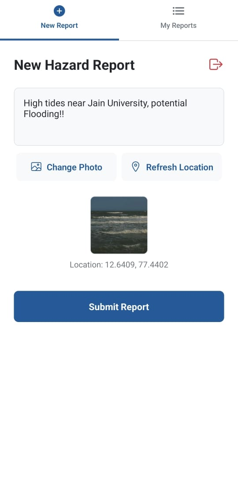
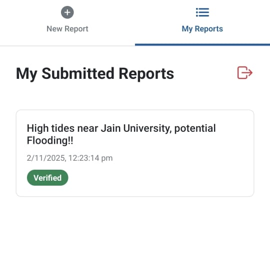
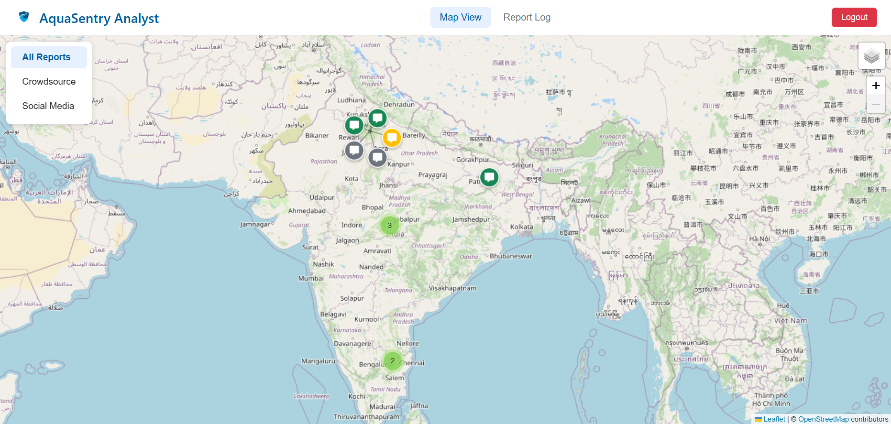
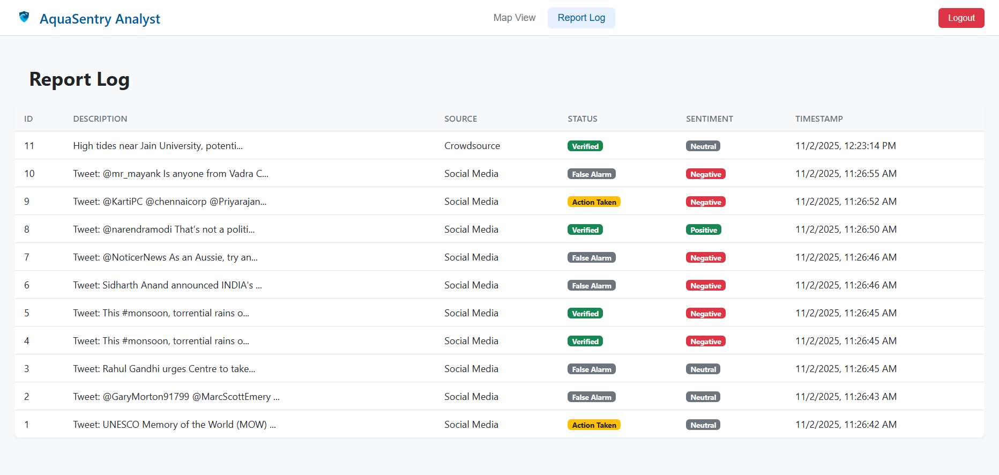
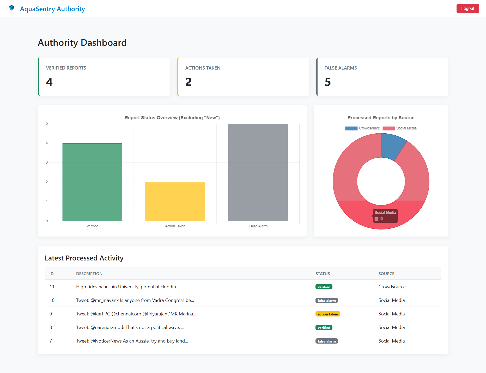

# AquaSentry: Ocean Hazard Reporting & Analytics Platform

**AquaSentry** ("Ocean Sentry") is a full-stack, integrated platform designed for the real-time reporting, verification, and analysis of ocean-related hazards. It connects citizens on the coast directly with analysts and authorities, enabling faster and more effective emergency response.

This project is built on a 3-role system:
* **Citizens (Mobile):** Use a React Native app to submit reports with photos and GPS locations.
* **Analysts (Web):** Use a live map dashboard to see all incoming reports, verify them, add notes, and update their status.
* **Authorities (Web):** Use a high-level dashboard to monitor processed reports, track statistics, and view summaries.

---

## Gallery

### Web Portal: Home & Login

| Description | Screenshot |
| :--- | :---: |
| **Home Page** |  |
| **Portal Login** |  |

### Citizen Mobile App (React Native)

| Description | Screenshot |
| :--- | :---: |
| **Login Screen** |  |
| **New Report Form** |  |
| **"My Reports" Status** |  |

### Analyst Dashboard (Web)

| Description | Screenshot |
| :--- | :---: |
| **Main Map View (Satellite + Clustering)** |  |
| **Full Detail Sidebar (Sentiment + Photos)** |  |
| **Report Log (Table View)** |  |

### Authority Dashboard (Web)

| Description | Screenshot |
| :--- | :---: |
| **Full Dashboard View** |  |

---

## Core Features

### Platform & Workflow
* **Role-Based Authentication:** Secure login for three distinct user roles (Citizen, Analyst, Authority).
* **Analyst Verification Workflow:** A full sidebar interface for analysts to add notes and update a report's status (e.g., `New` -> `Verified` -> `Action Taken` / `False Alarm`).
* **Citizen Status Check:** Citizens can view the live status of their own submitted reports in the mobile app.

### Citizen Mobile App (React Native)
* **Cross-Platform:** Built with React Native (Expo) for both Android and iOS.
* **Photo & GPS Reporting:** Citizens can submit reports with a description, precise GPS location, and an uploaded photo.

### Analyst Dashboard (Web)
* **Real-time Report Map:** A live-updating Leaflet.js map showing all incoming reports.
* **Marker Clustering:** Automatically groups dense reports into clean clusters using `Leaflet.markercluster`.
* **Custom Map Markers:** Color-coded SVG markers to differentiate report status (New, Verified) and source (Citizen vs. Social Media).

### Authority Dashboard (Web)
* **Analytics & KPIs:** A dashboard built with Chart.js showing Key Performance Indicators (KPIs), charts for status breakdowns, and a log of the latest processed reports.

### Backend & NLP
* **Social Media Integration:** A Python script uses the X (Twitter) API (via Tweepy) to find relevant hazard-related tweets.
* **NLP Geocoding:** Uses **spaCy** (NER) to find and extract location names from tweets.
* **Sentiment Analysis:** Uses **vaderSentiment** to analyze the sentiment (Positive, Negative, Neutral) of social media posts.

---

## Tech Stack

* **Backend:** **Python**, **Flask**, Flask-SQLAlchemy, Flask-Login
* **Database:** **SQLite**
* **Web Frontend:** **HTML5**, **CSS3**, **JavaScript** (Vanilla)
* **Web Mapping:** **Leaflet.js**, Leaflet.markercluster
* **Web Charts:** **Chart.js**
* **Mobile App:** **React Native** (with Expo)
* **NLP / Social Media:** **Tweepy** (X API), **spaCy** (Location NER), **vaderSentiment**, **Geopy**

---

## Setup and Installation

Follow these steps to get the full application running locally.

### 1. Prerequisites
* **Python** (3.10+)
* **Node.js** (LTS version)
* **Expo Go App** on your mobile phone (from the App Store / Play Store)
* **Git**

### 2. Configuration (API Keys & Networking)

Before running, you must set two critical variables:

**A) X (Twitter) API Key:**
1.  Open the `social_media_fetcher.py` file.
2.  Find the `BEARER_TOKEN = "YOUR_TOKEN_HERE"` placeholder.
3.  Replace it with your actual X API Bearer Token.

**B) Mobile App API URL:**
This is the most important step for connecting the mobile app to your computer.
1.  Open a terminal or Command Prompt.
2.  Find your computer's **Local IP Address**.
    * On Windows: `ipconfig` (Look for "IPv4 Address")
    * On macOS/Linux: `ifconfig` or `ip addr` (Look for "inet")
    * *It will look like `192.168.1.5` or `10.0.0.2`.*
3.  Open the `mobile-app/App.js` file.
4.  Find the line: `const API_BASE_URL = 'http://YOUR_COMPUTER_IP:5000';`
5.  Replace `YOUR_COMPUTER_IP` with the IP address you just found (e.g., `http://192.168.1.5:5000`).

### 3. Backend & Web Portal (Terminal 1)

This will run the Flask server and the web dashboards.

```bash
# Clone the repository
git clone [https://github.com/your-username/aquasentry.git](https://github.com/your-username/aquasentry.git)
cd aquasentry

# Create and activate a virtual environment
python -m venv venv
# On Windows
venv\Scripts\activate
# On macOS/Linux
source venv/bin/activate

# Install Python dependencies
pip install -r requirements.txt

# Download the spaCy NLP model
python -m spacy download en_core_web_sm

# Run the server
# This will also automatically create the 'instance/reports.db' file
python app.py
```
Your backend is now running at `http://0.0.0.0:5000`. You can access the web portal in your browser at **`http://127.0.0.1:5000`**.

### 4. Citizen Mobile App (Terminal 2)

This will run the React Native (Expo) app for citizens.

```bash
# Open a NEW terminal window
cd aquasentry/mobile-app

# Install dependencies
npm install

# Start the Expo server
npx expo start
```
Scan the QR code shown in your terminal using the **Expo Go app** on your phone. Your phone must be on the **same Wi-Fi network** as your computer.

### 5. (Optional) Populate Social Media Reports (Terminal 3)

This script will fetch 10 sample tweets, analyze them, and add them to the database for the Analyst to see.

```bash
# Open a THIRD terminal window
cd aquasentry

# Activate the virtual environment
# On Windows
venv\Scripts\activate
# On macOS/Linux
source vE/bin/activate

# Ensure your 'app.py' server is still running in Terminal 1
# Ensure you've added your BEARER_TOKEN (Step 2A)

# Run the script
python social_media_fetcher.py
```

---

## Default Logins

You can access the web portals using these default credentials:

* **Analyst Portal:**
    * URL: `http://127.0.0.1:5000/login`
    * Username: `analyst`
    * Password: `password`

* **Authority Portal:**
    * URL: `http://127.0.0.1:5000/login`
    * Username: `authority`
    * Password: `password`

* **Citizen App:**
    * Open the app on your phone and **register a new account**.

---

## License

This project is licensed under the MIT License - see the `LICENSE.md` file for details.
